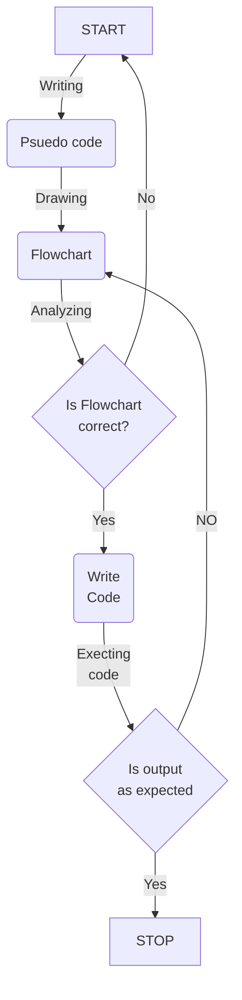

# Introduction
- Git is a distributed version control system that tracks versions of files.
-  GitHub is a cloud-based platform where you can store, share, and work together with others to write code.
- GitLab is the most comprehensive AI-powered DevSecOps Platform.
- .md files uses Markdown language.[^1][^5]
- .md files also uses HTML language to use elements.
# Basics
- Create account and sign in
- Create new git repository
- Clone the repository `git clone repo_url`
- Add changes made in the repository `git add file_name` or `git add .`
- Check status `git status`
- Commit changes `git commit -m 'comment'`
- Push repository using token as password `git push`
>Note : 
>- A token must be generated before `git push` and that token will never be visible again (store the token safely forever)
# Headings 
- Headings are used to create hierarchy level
- Heading level from 1 to 6 '#'
- Syntax :  ```# Heading_title```
# Bullet list
- Used to create list in hierarchy
- Syntax :  ```- list``` or ```* list ```
# Referencing References / Footnotes
- To Link [^2]
- To Text [^3] 
- Syntax :  ```[^1]```
# Hyperlink
- To local file [[test_file]] , syntax : ```[[path/test_file]]```
- To web page https://google.com , syntax :  ```url```
- On Text [Google](https://google.com) , syntax :  ```[Text](url)```
# Embedded objects [^9][^10]
* Embedding Heading : [Basics of Github](#Basics) , Syntax : ```[Text](#Heading_title)```
- Embedded text , syntax  : ```![[path/test_file]]```
![[./data/test_file.md]]
- Embedded media, syntax : ```](file_path/image_file)```
 - Can Embedded either by link (url_to_file) or locally (path/file)
 - Media embedded may be audio, image, video, URL, file etc.
 - Example of embedded image [](https://upload.wikimedia.org/wikipedia/commons/8/8f/Orange_lambda.svg)
 - Example of embedded video [](https://www.youtube.com/watch?v=dQw4w9WgXcQ)
- Embedded media (html) uses element to enable media features.
 - Embedded media syntax (html) :
 ```html
<div style="position: relative; width: 100%; padding-bottom: 50%">
<iframe src="url" 
        title="title" frameborder="0" allowfullscreen
        allow="accelerometer; autoplay; clipboard-write; encrypted-media; gyroscope; picture-in-picture" 
        style="position: absolute; width: 100%; height: 100%;">
</iframe>
</div>
```
 - Simple embedded media syntax (html):
```html
<iframe src="url" style="width:100%; height:500px;" ></iframe>
```
 - Example of Embedded video (html)
<div style="position: relative; width: 100%; padding-bottom: 50%">
<iframe src="https://www.youtube.com/watch?v=dQw4w9WgXcQ" 
        title="Getting Rick Rolled" frameborder="0" allowfullscreen
        allow="accelerometer; autoplay; clipboard-write; encrypted-media; gyroscope; picture-in-picture" 
        style="position: absolute; width: 100%; height: 100%;">
</iframe>
</div>
 - Example of embedded page (html)
<iframe src="https://www.markdownguide.org/basic-syntax/" style="width:100%; height:500px;" ></iframe>


- Horizontal Ruler Syntax :  ```---```
---


# Quoting
- Text, syntax : ```> Text ```
> Here is Quoted text `Here is quoted code?`
- Code , syntax : ``` ```sd``` ```

```
Copy Code from here 
```
# Quoting code
```python
print("Hello, World!")
exit(0)
```

# Text formatting
- ==Highlight==
- **Bold** __, Bold 2__
- *Italic* _, Italic 2_
- ~~Strike through~~
- log<sub>e</sub>(e<sup>2</sup>)=2
# check boxes
- [ ] Unchecked box
- [x] Checked box
# Mermaid Graph [^4]

# GeoJSON map
> Note : Uses currently uses `[longitude,latitude]` system
```geojson
{
  "type": "FeatureCollection",
  "features": [
    {
      "type": "Feature",
      "id": 1,
      "properties": {
        "ID": 0
      },
      "geometry": {
        "type": "Polygon",
        "coordinates": [
          [
			[73.705819 ,18.589174 ],
			[73.705636 ,18.589121 ],
			[73.705655 ,18.589033 ],
			[73.705516 ,18.588992 ],
			[73.705538 ,18.588916 ],
			[73.705423 ,18.588885 ],
			[73.705495 ,18.588640 ],
			[73.705930 ,18.588758 ],
			[73.705819 ,18.589174 ]
          ]
        ]
      }
    }
  ]
}
````
# TopoJSON map
```topojson
{
  "type": "Topology",
  "transform": {
    "scale": [0.0005000500050005, 0.00010001000100010001],
    "translate": [100, 0]
  },
  "objects": {
    "example": {
      "type": "GeometryCollection",
      "geometries": [
        {
          "type": "Point",
          "properties": {"prop0": "value0"},
          "coordinates": [4000, 5000]
        },
        {
          "type": "LineString",
          "properties": {"prop0": "value0", "prop1": 0},
          "arcs": [0]
        },
        {
          "type": "Polygon",
          "properties": {"prop0": "value0",
            "prop1": {"this": "that"}
          },
          "arcs": [[1]]
        }
      ]
    }
  },
  "arcs": [[[4000, 0], [1999, 9999], [2000, -9999], [2000, 9999]],[[0, 0], [0, 9999], [2000, 0], [0, -9999], [-2000, 0]]]
}
```
# 3D model
```stl
solid cube_corner
  facet normal 0.0 -1.0 0.0
    outer loop
      vertex 0.0 0.0 0.0
      vertex 1.0 0.0 0.0
      vertex 0.0 0.0 1.0
    endloop
  endfacet
  facet normal 0.0 0.0 -1.0
    outer loop
      vertex 0.0 0.0 0.0
      vertex 0.0 1.0 0.0
      vertex 1.0 0.0 0.0
    endloop
  endfacet
  facet normal -1.0 0.0 0.0
    outer loop
      vertex 0.0 0.0 0.0
      vertex 0.0 0.0 1.0
      vertex 0.0 1.0 0.0
    endloop
  endfacet
  facet normal 0.577 0.577 0.577
    outer loop
      vertex 1.0 0.0 0.0
      vertex 0.0 1.0 0.0
      vertex 0.0 0.0 1.0
    endloop
  endfacet
endsolid
```
# Table

| Sr no. |                     Data | Data 2       |
| :----: | -----------------------: | :----------- |
|   1    |            Right aligned | Left aligned |
|   2    | Special character ( \| ) |              |
# Picture
<picture>
  <source media="(prefers-color-scheme: dark)" srcset="https://user-images.githubusercontent.com/25423296/163456776-7f95b81a-f1ed-45f7-b7ab-8fa810d529fa.png">
  <source media="(prefers-color-scheme: light)" srcset="https://user-images.githubusercontent.com/25423296/163456779-a8556205-d0a5-45e2-ac17-42d089e3c3f8.png">
  
</picture>

# References
- Syntax : ```[^1]:Reference here```

[^1]:https://docs.github.com/en/get-started
[^2]: https://docs.github.com/en/get-started/writing-on-github/getting-started-with-writing-and-formatting-on-github/basic-writing-and-formatting-syntax
[^3]: Reference text
[^4]:https://mermaid.live/edit
[^5]:https://www.markdownguide.org/basic-syntax/
[^9]:https://tiiny.host/blog/images-in-markdown/
[^10]:https://markdownmonster.west-wind.com/docs/_4xs10gaui.htm